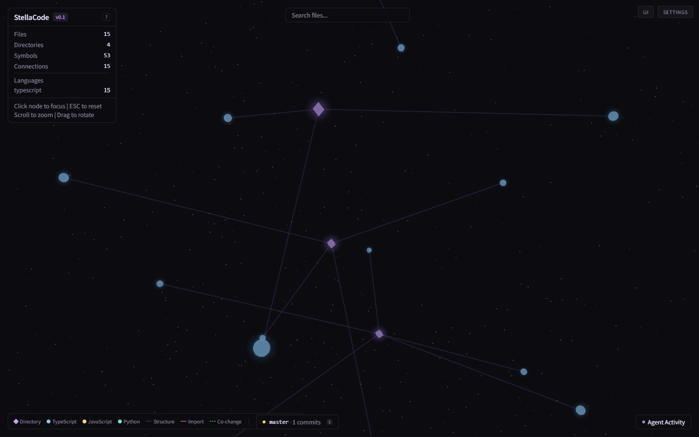
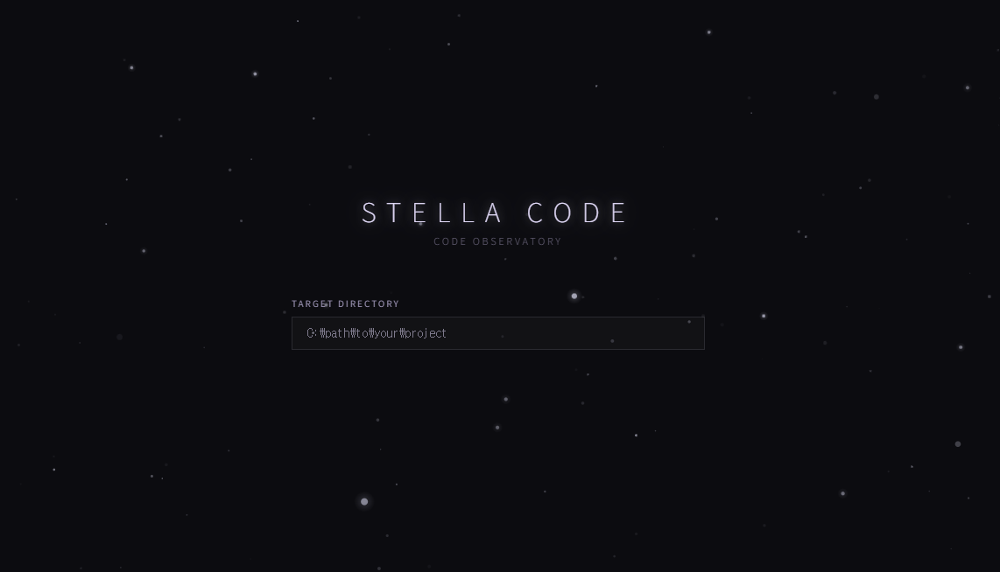
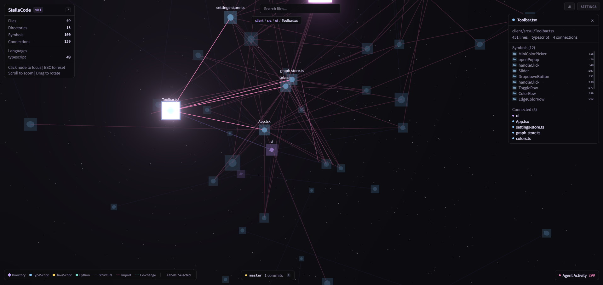

# StellaCode

**Code Observatory** -- observe your codebase as a living constellation.

[](https://www.npmjs.com/package/stellacode)
[](https://github.com/juvenilehex/stellacode/actions/workflows/ci.yml)
[](https://discord.gg/VGQJSda5eZ)
[](LICENSE)

```bash
npx stellacode
```

> One command. No install. Open http://localhost:3001 and point it at any project.



## Why

We talk to AI, and code appears. Files multiply. One day you look around and realize you have a project you built -- but don't quite recognize anymore. Where does this connect? What did the AI change while you weren't looking? What keeps quietly breaking together?

It can feel a little overwhelming. We thought it might help to just... see it.

Every file becomes a star. Every import draws a constellation line. Hidden couplings -- files that always change together but share no import -- glow as teal threads you never knew existed. And when an AI agent touches your code, it leaves a trail across the sky.

**Understand your project at a glance, and maybe feel something while you do.**

If you've been staring at strings of text in a dark room for hours, we hope watching your code quietly glow and orbit can offer a moment of calm. Your project is alive. It's growing. And now you can see it.

## Quick Start

Or clone and run locally:

```bash
git clone https://github.com/juvenilehex/stellacode.git
cd stellacode
npm install
npm run dev
```

Open http://localhost:3001 and enter the path to any project.


*The landing screen — enter a path and watch your code come alive.*

## What You See

| Celestial body | What it means |
|----------------|---------------|
| **Star** | A file. Size = complexity (symbol count). Color = language. |
| **Constellation Line** | An import relationship. The declared wiring of your code. |
| **Co-change Thread** | Files that change together in git, with no import between them. Hidden coupling. |
| **Trail** | The path an AI agent left across your codebase. |
| **Pulse** | A file changing right now. |
| **Diamond** | A directory. The structure that holds stars together. |

## Features

### Code Structure
- 3D force-directed graph with golden ratio spiral layout
- Files as stars, directories as diamonds, imports as constellation lines
- Language detection (TypeScript, JavaScript, Python) with color coding
  > Currently supports TypeScript, JavaScript, and Python. Want another language? [Let us know on Discord.](https://discord.gg/VGQJSda5eZ)
- Search, filter by language, click to inspect

### Git Intelligence
- **Co-change detection** -- finds files that always change together, even without imports. These hidden dependencies are often where bugs hide.
- **Conventional commit parsing** -- feat, fix, refactor badges on each commit
- **Hot files** -- most frequently modified files, ranked
- **Activity heatmap** -- 30-day commit visualization
- **Branch status** -- current branch, clean/dirty state

### AI Agent Tracking
- Detects commits from Claude Code, Copilot, Cursor, Aider, Codeium, Tabnine, Windsurf, Devin, Amazon Q, Gemini, and Bolt
- Agent trails show which areas each AI has touched
- See the boundary between human and machine work

### Visual Experience
- **Entry animation** -- stars bloom into existence when the constellation loads
- **Complexity glow** -- complex files burn brighter
- **Co-change pulse** -- coupled files breathe together
- **Code age coloring** -- old stars glow red, new stars glow blue
- **Agent color mode** -- see which AI touched which file
- **Nebula clouds, shooting stars, 4-layer starfield** -- deep space atmosphere
- **3-point cinematic lighting** -- warm key, cool fill, purple rim

### Time Travel
- **Commit replay** -- watch your constellation grow commit by commit
- **Timeline slider** -- scrub through your project's history
- **Playback controls** -- play, pause, rewind

### Observe Mode
Press `O` to hide all UI and watch the stars quietly. Just your code, breathing in the dark.

### Capture
Press `3` to save a PNG screenshot of your constellation.


*Click any star to see its symbols, connections, and place in the constellation.*

## Controls

| Action | Input |
|--------|-------|
| Rotate | Click + drag |
| Zoom | Scroll wheel |
| Focus a star | Click it |
| Star info | Hover |
| Deselect | Click empty space |
| Search | `Ctrl+F` or search bar |
| Observe mode | `O` |
| Label mode cycle | `L` |
| Color mode: default | `1` |
| Color mode: age | `2` |
| Color mode: agent | `3` |
| Screenshot | Capture button |

## Architecture

```
Browser (React + R3F)            Server (Express)
  Three.js 3D scene                Directory scanner
  Zustand stores                   Code parser (TS/JS/Python)
  UI panels                        Graph builder + force layout
  WebSocket client                 WebSocket broadcaster
                                   File watcher (chokidar)
                                   Agent tracker (git + .claude/)
```

```
Data flow:
  Your Project --> Scanner --> Parser --> Graph Builder --> Force Layout --> WebSocket --> 3D Scene
```

### Tech Stack

| Layer | Choice |
|-------|--------|
| Build | Vite 6 |
| Frontend | React 19 + TypeScript |
| 3D | React Three Fiber + drei + postprocessing |
| State | Zustand |
| CSS | Tailwind CSS 4 |
| Server | Express 5 + ws + chokidar |
| Parser | Regex-based (TS/JS/Python) |

## API

| Endpoint | Description |
|----------|-------------|
| `GET /api/graph` | Full graph (nodes, edges, stats) |
| `GET /api/graph/node/:id` | Single node with connections |
| `GET /api/stats` | Project statistics |
| `GET /api/git/stats` | Git analysis (commits, branches, heatmap, co-changes) |
| `GET /api/git/log?limit=50` | Parsed git log |
| `GET /api/git/co-changes` | Temporal coupling analysis |
| `GET /api/agent/events` | AI agent activity events |
| `GET /api/agent/sessions` | Active agent sessions |
| `POST /api/target` | Change target directory |

WebSocket at `ws://localhost:3001/ws` pushes `graph:update`, `file:change`, and `agent:live` events.

## Development

```bash
npm run dev       # Start server + client
npm run build     # Production build
npm run lint      # Type-check both packages
npm test          # Run server tests
```

```bash
# Dogfooding -- observe StellaCode with StellaCode
STELLA_TARGET=./ npm run dev
```

## Feedback

StellaCode is still young, and we'd love to hear what you think.

- **Discord**: [Join the server](https://discord.gg/VGQJSda5eZ) -- share your constellation, tell us what's broken, or just say hi
- **GitHub Issues**: open an issue if you prefer

See [CONTRIBUTING.md](CONTRIBUTING.md) for details.

## License

MIT
